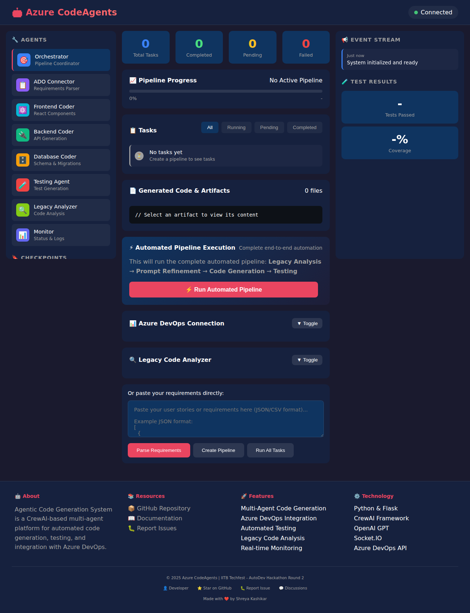

# 🤖 Agentic Code Generation System

A CrewAI-based multi-agent system for generating working code and testing with a real-time UI interface showing status.

## ⚡ Dynamic Code Enhancement

**The system features dynamic code enhancement using AI agents!** Generated code is automatically improved using:
- **Legacy Analyzer** - Matches existing codebase patterns
- **Prompt Refiner** - Eliminates ambiguity and improves quality  
- **Testing Agent** - Generates comprehensive test coverage

## ⚡ Fully Automated Pipeline

**The system supports complete end-to-end automation!** All agents work together automatically without manual button clicks.


## 🏗️ Architecture

```
┌─────────────────────────────────────────────────────────────────────────┐
│                     Agentic Code Generation System                      │
│                                                                         │
│  ┌────────────────────────────────────────────────────────────────────┐ │
│  │                      Orchestrator Agent                            │ │
│  │   - Builds pipeline from canonical spec                            │ │
│  │   - Creates dependency graph                                       │ │
│  │   - Enforces quality gates                                         │ │
│  └────────────────────────────────────────────────────────────────────┘ │
│                             │                                           │
│          ┌──────────────────┼──────────────────┐                        │
│          │                  │                  │                        │
│          ▼                  ▼                  ▼                        │
│  ┌──────────────┐  ┌──────────────┐  ┌──────────────┐                   │
│  │  ADO Agent   │  │ Coding Agents│  │Testing Agent │                   │
│  │  - Parse JSON│  │ - Frontend   │  │ - Pytest     │                   │
│  │  - Parse CSV │  │ - Backend    │  │ - Playwright │                   │
│  │  - Normalize │  │ - Database   │  │ - Coverage   │                   │
│  └──────────────┘  └──────────────┘  └──────────────┘                   │
│                            │                  │                         │
│                            ▼                  ▼                         │
│                    ┌──────────────┐  ┌──────────────┐                   │
│                    │Legacy Analyze│  │Prompt Refine │                   │
│                    │ - Tech stack │  │ - Hallucinate│                   │
│                    │ - Migration  │  │ - Ambiguity  │                   │
│                    └──────────────┘  └──────────────┘                   │
│                                                                         │
│  ┌────────────────────────────────────────────────────────────────────┐ │
│  │                      Monitoring & UI Agent                         │ │
│  │   - Event streaming        - Checkpoints & rollback                │ │
│  │   - Real-time dashboard    - Artifact regeneration                 │ │
│  └────────────────────────────────────────────────────────────────────┘ │
└─────────────────────────────────────────────────────────────────────────┘
```

## 🚀 Features

### Core Agents

1. **ADO Connector & Parser Agent**
   - Connects to Azure DevOps via REST API
   - Parses exported JSON/CSV data
   - Extracts user stories, acceptance criteria, personas
   - Normalizes requirements into canonical spec

2. **Coordinating Agent (Orchestrator)**
   - Builds execution pipeline from requirements
   - Creates dependency graph for tasks
   - Enables parallel execution where safe
   - Enforces quality gates (test coverage, passing tests)

3. **Coding Agents**
   - **Frontend**: React components, routes, forms, accessibility
   - **Backend**: FastAPI endpoints, services, controllers
   - **Database**: Schema migrations, ORM models

4. **Testing Agent**
   - Generates unit tests with Pytest
   - Generates integration tests
   - Generates E2E tests with Playwright
   - Produces pass/fail reports with coverage

5. **Legacy Analysis Agent**
   - Scans legacy repositories
   - Infers tech stack and architecture
   - Proposes integration strategies
   - Generates migration plans
   - **Auto-detects and applies legacy conventions to new code**

6. **Prompt Refinement Engine**
   - Detects hallucinations and ambiguity
   - Iteratively improves prompts
   - Feeds learnings back to Coordinator
   - **Automatically refines all prompts before code generation**

7. **Monitoring & UI Agent**
   - Streams event logs in real-time
   - Enables re-runs and rollbacks
   - Manages checkpoints
   - Provides dashboard data

## 📋 Requirements

- Python 3.9+
- OpenAI/Groq API key (for CrewAI)

## 🛠️ Installation

```bash
# Clone the repository
git clone https://github.com/shreyakash24/Round-2-project-AutoDev-Hackathon---IITB-Techfest-.git
cd Round-2-project-AutoDev-Hackathon---IITB-Techfest-

# Create virtual environment
python -m venv venv
source venv/bin/activate  # On Windows: venv\Scripts\activate

# Install dependencies
pip install -r requirements.txt

# Copy environment configuration
cp .env.example .env

# Edit .env and add your OpenAI API key
```

## 🚀 Running the Application

### Quick Start (Automated Mode)

1. **Start the server:**
   ```bash
   python main.py server
   ```

2. **Open the dashboard** at `http://localhost:5000`

3. **Configure Azure DevOps** (in the UI):
   - Enter your Organization URL, PAT, Project Name

4. **Click "🚀 Auto-Extract from Azure DevOps"** to fetch user stories

5. **Click "⚡ Run Automated Pipeline"** - Done! 
   - The system will automatically:
     - Analyze any legacy code
     - Refine all prompts
     - Generate code
     - Commit to Azure DevOps


### CLI Mode

```bash
python main.py cli
```

## 📝 User Story Format

The system accepts user stories in JSON or CSV format from ADO as well as input. Example is in test_json_sample.json

## 📊 UI Dashboard Features

- **Agent Overview**: See all agents and their status
- **Pipeline Progress**: Real-time progress bar
- **Task Management**: View, execute, and re-run tasks
- **Artifact Viewer**: Browse generated code with syntax highlighting
- **Event Stream**: Real-time event log
- **Test Results**: Pass/fail summary with coverage
- **Checkpoints**: Create and rollback to saved states

### Click for Demo 
<a href="https://drive.google.com/file/d/1T_E4Goz0NnWcxS2c-uEcEWomsWYBLhBm/view?usp=share_link" target="_blank">
  
</a>


